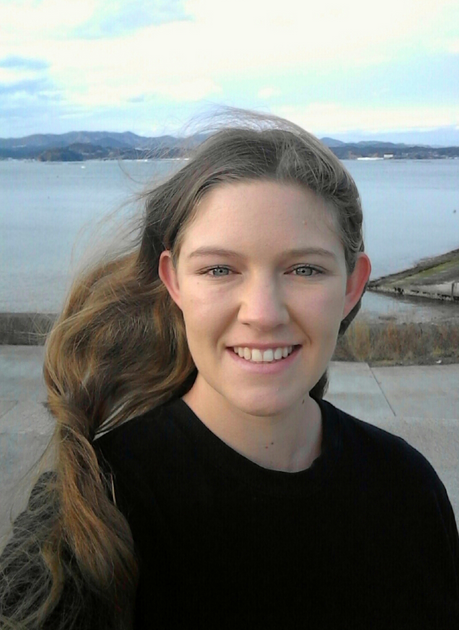

 

Welcome! I am Kayleigh Ward, an environmental sociologist, community engaged researcher, and public health advocate. 

I am research faculty within the Environmental Science Innovation and Impact Lab at the University of Colorado Boulder, and a lecturer with the Department of Public Health and Health Sciences at Northeastern University. I am a environmental sociologist, public health advocate and policy scholar who investigates how public water utilities’ values, governance, and policy designs shape water affordability, water poverty and environmental justice in the United States. In broader contexts, I focuse on disparate burdens and impacts, by highlighting how environmental health of both urban and rural populations suffer from poor social and environmental policy. Across these difference issues, I use actionable, public-facing evidence to translate findings into practical recommendations to improve equity, reduce water poverty and support just, sustainable infrastructure in urban and rural communities. 

[Personal Website](https://kayleighward.com/)

## Certifications
* MSU onGEO Professional GIS certificate (Department of Geography, Environment, and Spatial Sciences)
* MSU Community Engagement Certification (University Outreach and Engagement)

# H2OPE Project

The H2OPE (pronounced hope) project emerged after my time with the Social Science Environmental Health Research Institute, where I worked within the Water Equity Team (WET) Lab. H2OPE is an extension of the original research I started under WET, and supports both undergraduate and graduate students interested in studying socio-environmental problems related to water poverty, water equity, and water accessibility. Located at the intersection of equity, public health, and climate, H2OPE produces policy relevant research on how to address modern water issues in the United States.

## Current Projects

- Water Utility Scorecard and Affordability Dashboard: Being produced using R Shiny, the WUSA Dashboard will have data from 226 water utilities, including a scorecard function which grades water utilities on how well their existing assistance programs facilitate affordability and equity. The dashboard will be publicly accessible in 2026.

- Water Affordability and the Climate Gap: This research arm focuses on current issues with customer assistance programs, poverty and worsening climate change (e.g.,* drought and floods) affects on water utilities. Recognizing the climate gap (see Morello‑Frosch and Obasogie, 2023), this project focuses on how the disparate burden of climate change affects the health and well-being of low-income and racially marginalized groups when it comes to water affordability. Using county-level poverty data, flood and drought data, this on-going project assesses the extent to which existing assistance programs meet local poverty needs. Using current water rate projections under climate stress, we are also identifying future trends on the widening water affordability and climate gap.

- Water Policy and Capital Investment Plans (CIPs): This research arm focuses on the social and environmental values embedded in water utilities CIPs to investigate the environmental moral convergence or divergence of water operators. Compared to the water utility’s mission and other programs, this analysis highlights the extent to which utilities fulfill their expressed environmental beliefs.

## Team

Lead by Research Faculty, Kayleigh Ward, Cooperative Institute for Research in Environmental Sciences, Environmental Data Science Innovation & Inclusion Lab at the University of Colorado Boulder

- Lauren Gleason, Graduate Student, University of Colorado Boulder
- Amanda Rampy, Undergraduate Student, Northeastern University
- Sabrina Krista, Undergraduate Student, Northeastern University
- Romi Manela, Undergraduate Student, Northeastern University
- Anika Deodhar, Undergraduate Student, Northeastern University
- Emina Hurtic, Undergraduate Student, Northeastern University

## Publications and Editorials

Forthcoming, Ward, K., Gleason, L., Rampy, A., Krista, S., Manela, R., Hurtic, E., & Deodhar, A. Water assistance policies from 2016-2024: The gap between CAPs, LIHWAP, and Covid-19 moratoria in alleviating water poverty, under review.

Ward, K., Srinivasan, J., Alvord, D., Senier, L., Davis, M., Harlan, S. L., … Deodhar, A. (2024). Municipal capacity for water justice: a cross-case comparison of affordability and equity policies in Pennsylvania and Massachusetts. Journal of Environmental Policy & Planning, 26(4), 353–373.

Forthcoming, Ward, K., Srinivasan, J., Alvord, D., Senier, L., Davis, M., Harlan, S. L., … Deodhar, A. Unaffordable Water in US Cities: How Values and Theories of Justice Motivate Policy. Under review.

