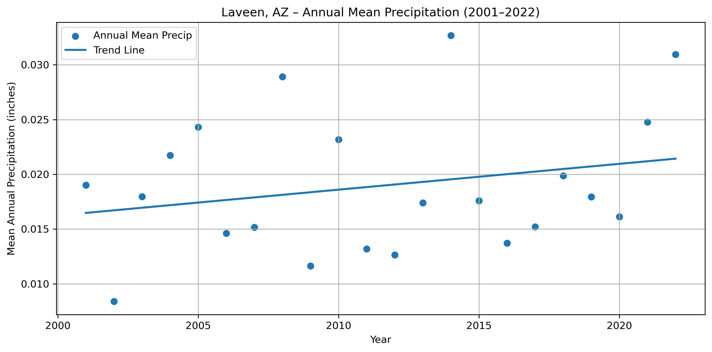
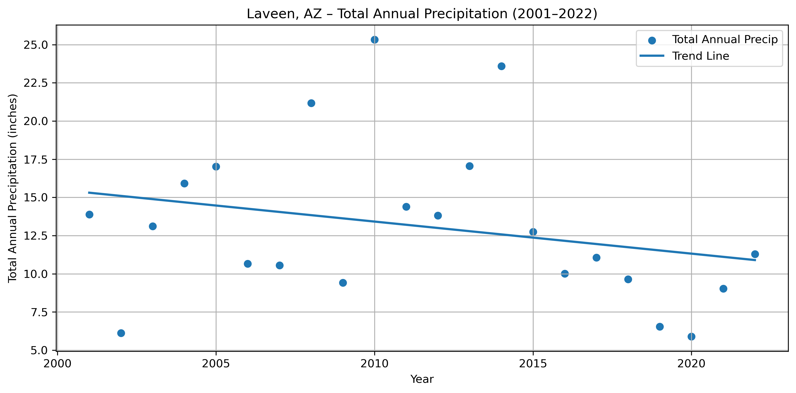
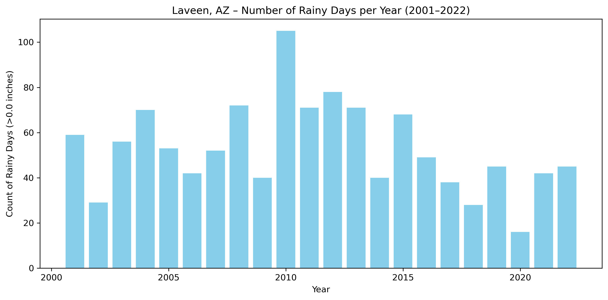
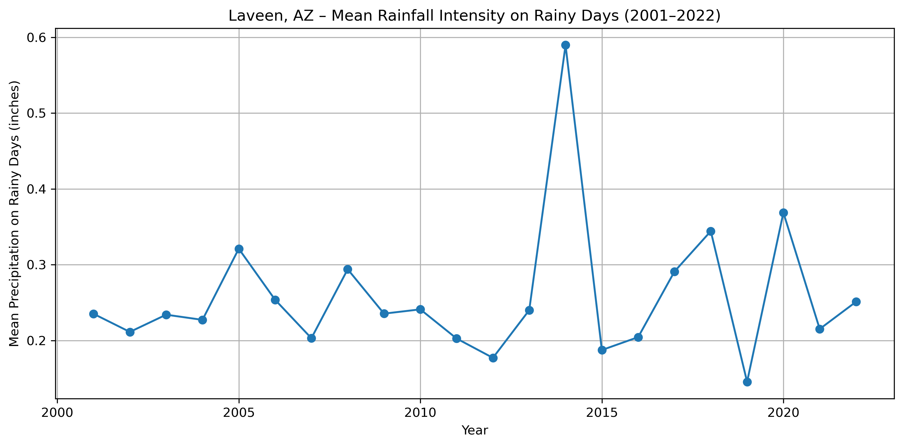
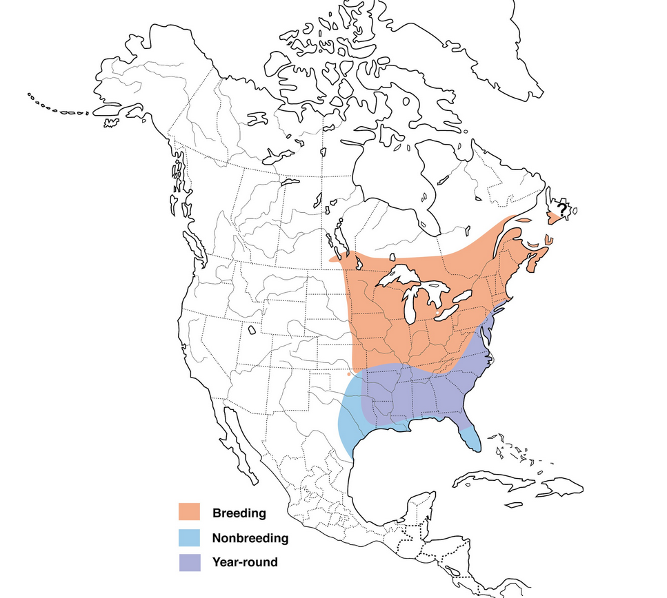

 

Welcome! I am Kayleigh Ward, an environmental sociologist, community engaged researcher, and public health advocate. 

I am research faculty within the Environmental Science Innovation and Impact Lab at the University of Colorado Boulder, and a lecturer with the Department of Public Health and Health Sciences at Northeastern University. I am a environmental sociologist, public health advocate and policy scholar who investigates how public water utilities’ values, governance, and policy designs shape water affordability, water poverty and environmental justice in the United States. In broader contexts, I focuse on disparate burdens and impacts, by highlighting how environmental health of both urban and rural populations suffer from poor social and environmental policy. Across these difference issues, I use actionable, public-facing evidence to translate findings into practical recommendations to improve equity, reduce water poverty and support just, sustainable infrastructure in urban and rural communities. 

[Personal Website](https://kayleighward.com/)

As a fun fact, I did many years of disaster work in Japan, in a community called Minamisanriku. See a map of Minamisanriku and their fishing boundaries below! I frequently still give talks on small scale fisheries. 

# EDS Portfolio

## Ramona Fire Recovery Project  
### Vegetation Change, Fire History, and Climate Trends in Cedar & Witch Fire Landscapes (2000–2024)

I have been building a geospatial analysis of long-term vegetation recovery in the Ramona, CA region, focusing on two major wildfires: the **Cedar Fire (2003)** and the **Witch Fire (2007)**. Using a combination of RCMAP shrub cover data (1998–2024), NASA AppEEARS MODIS NDVI data, and high-resolution fire perimeter and buffer analyses, this project explores how vegetation structure and greenness recover inside fire scars compared to surrounding landscapes.

You can follow the methods for each piece of this project by clicking on the following html files for each notebook that was created to code this. 

1. [Overview notebook html](img/00_00_project_overview.html)
2. [Ramona climate change notebook html](img/01_00_ramona_climate_change.html)
3. [Ramona fire perimeters notebook html](img/01_ramona_fire_perims.html)
4. Landcover notebooks [1](img/01_load_landcover_data_2024.html), [2](img/02_cedar_fire_landcover_change.html), [3](img/03_witch_fire_landcover_change.html) and [4](img/04_inside_vs_outside_comparison.html) htmls (click each number for each notebook)
5. [NDVI recovery notebook html](img/01_ndvi_recovery_timeseries.html) 

You can also find the repository for this project at https://github.com/kward-alt/ramona-fire-recovery (please pardon my dust as that repository is fully built out with its associated readme, yml, and other files for replication).

---

### Why Ramona? 
#### Brief Social, Political, and Agricultural History of Ramona
Ramona is a rural community located in the backcountry of San Diego County. The region was originally inhabited by the Kumeyaay people and later became part of Spanish and Mexican land grants in the Santa Maria Valley. During the 1870s Gold Rush, Ramona served as a key stagecoach stop between San Diego and Julian.

After the Gold Rush, Ramona remained a quiet agricultural community. By the early 1900s, it earned national recognition as the “Turkey Capital of the World,” and ranching of poultry and cattle supported the local economy. In recent decades, zoning changes and population shifts have reduced agricultural activity. Despite these changes, Ramona continues to maintain a strong rural and community-oriented identity.

*Citations:* (Shipek, 1988; Pourade, 1965).

#### The Ramona Landscape, Geography, and Topography
Known as the *Valley of the Sun*, Ramona experiences hot summers, mild winters, and significant inland temperature variability. The town lies within a large valley surrounded by mountains ranging from ~1,000 to over 2,300 feet in elevation and is partially bordered by the Cuyamaca Mountains and the Cleveland National Forest.

Ramona is situated within the Southern California chaparral biome, dominated by drought-tolerant, fire-adapted shrubs. Shrubland is especially prominent along the rugged hills that border town, while oak stands occupy ravines and river corridors. The region is also characterized by rocky terrain, with Highways 67 and 78 carved directly into steep mountain faces.

*Citations:* (Keeley et al., 2004).

#### The 2000s “Ring of Fire”
Prior to the 2000s, Ramona had limited exposure to high-intensity wildfire events. This shifted dramatically in the early twenty-first century.

**2003 Cedar Fire**
- Burned over 200,000 acres—at the time, the largest fire in California history.
- Impacted regions east, southeast, and southwest of Ramona.
- Burned for more than a month under extreme weather conditions.

**2007 Witch Creek Fire**
- Ignited north of town and burned the entire northern corridor.
- Though smaller than the Cedar Fire, it significantly affected local vegetation and communities.

Together, these fires created a complete “ring” around Ramona. Residents frequently describe the 2000s as a defining decade shaped by fire and note that the landscape has not fully recovered—even nearly twenty years later.

*Citations:* CAL FIRE (Cedar Fire 2003; Witch Creek 2007).

#### Investigating the Ring of Fire
Residents are correct that wildfire dramatically alters the landscape, but quantifying these changes requires spatial and temporal analysis.  
This project investigates climate patterns, vegetation health, and land-cover change in Ramona before and after the Cedar and Witch Creek Fires using temperature trends, NDVI time series, and shrubland cover datasets.

### Assumptions and Hypotheses

#### **A1. Climate Change Assumption**
**Ramona has experienced measurable climate change, consistent with both observational data and lived experiences.**  
- Tested by analyzing long-term temperature trends (TMAX, TMIN, TAVG).

#### **H1. Vegetation Recovery Hypothesis**
**Vegetation in Ramona has not fully recovered from the 2003 Cedar and 2007 Witch Creek Fires.**

##### **H1.1 – Shrubland differences within vs. outside fire perimeters**
Test through:
- Mapping fire boundaries.
- Analyzing RCMAP shrub cover for 1998–2010 and 2011–2024.
- Comparing land cover 3 years before and after each fire  
  *(2000–2003–2006 for Cedar; 2004–2007–2010 for Witch).*

##### **H1.2 – NDVI differences within vs. outside fire perimeters**
Test through:
- Using NASA AppEEARS MODIS NDVI (2000–2020).
- Comparing NDVI inside and outside fire perimeters for key pre- and post-fire years.

### Datasets Used in This Project

#### **For A1: Climate Trends**
- **NOAA NCEI Daily Temperature Data**  
  *Station:* GHCND:USW00053120 (Ramona, CA)  
  - Includes TAVG, TMIN, and TMAX from 1998–2025.  
  - Used to detect long-term warming trends.  
  *(NOAA National Centers for Environmental Information, 2025).*

#### **For H1.1: Shrubland Cover Analysis**
- **California Census Designated Places (CDPs)** – Boundary of Ramona.  
- **California Historic Fire Perimeters (1950–present)** – Cedar (2003), Witch Creek (2007) boundaries.  
- **California Protected Areas Database (CPAD) 2025** – Local open-space geometry.  
- **MRLC/USGS RCMAP Time-Series Shrub Cover (2000–2020)**  
  - Annual shrub cover for Ramona area.  
  - Trend layers: slope (% change per year) and p-value.  
  - Used for within/outside perimeter comparisons.  
  *(MRLC/USGS, 2020).*

#### **For H1.2: NDVI Vegetation Health**
- **NASA MODIS NDVI (AppEEARS, 2000–2020)**  
  - Spatially clipped NDVI data for southern California.  
  - Supports analysis of vegetation health inside and outside fire perimeters across key timepoints.  
  *(NASA LP DAAC, 2023).*

#### References
- CAL FIRE. (2003). Cedar Fire Incident Report.
- CAL FIRE. (2007). Witch Creek Fire Incident Report. 
- Keeley, J. E., Fotheringham, C., & Mortiz, A., M. (2004). Lessons from the 2003 wildfires in southern California. https://moritzfirelab.org/wp-content/uploads/2016/01/keeley_etal_2004-2.pdf 
- MRLC/USGS. (2020). *RCMAP Shrub Cover Time Series.*  
- NASA LP DAAC. (2023). *Moderate Resolution Imaging Spectroradiometer (MODIS) NDVI.*  
- NOAA National Centers for Environmental Information. (2025). *Climate Data Record for Ramona, CA.*  
- Pourade, R. (1965). *Gold in the Sun: The History of San Diego.* San Diego Historical Society. Madrona Pub.  
- Shipek, F. (1988). *PUSHED INTO THE ROCKS, Southern Indian Land Tenure, 1769-1986.* University of Nebraska Press. 

### Study Area
Before we can get to the fun analyses, I had to create a variety of boundaries for this project including those for Ramona, both fires, as well as buffer around these fires. Below you can see how these ended up plotting before we move onto the land cover changes, NDVI calculations and the Ramona climate data. 

The analysis is centered on the **Ramona Census Designated Place (CDP)** boundary in San Diego County. I constructed a consistent spatial data pipeline using `geopandas`, `rasterio`, and `xarray` in **EPSG:3310 (California Albers)** to ensure all rasters and vector layers align correctly. For all boundary axes, these will be northing (meters) for the y axis and easting (meters) for the x axis. 

### Fire Perimeters & Buffer Zones

To evaluate differential recovery, I created inside-vs-outside comparisons using:

- Cedar Fire perimeter (2003)  
- Witch Fire perimeter (2007)  
- A **0–4 km buffer** around each perimeter representing “outside” comparison zones  
- Ring geometries representing only the buffer area (buffer minus interior fire scar)

These geometries were used to clip both shrub cover and NDVI data while preserving consistent CRS and extent. Here you can see how the fires overlap with Ramona, creating a "ring of fire."

---
Now we can see the fun analyses! Lets check out the shrub cover change, NDVI change and climate in Ramona!

### RCMAP Shrub Cover (1998–2024)

Using RCMAP’s time-series shrub cover product, I calculated:

- **Percent shrub cover inside vs. outside each fire boundary**  
- **Pixel distributions by east vs. west sectors**  
- **Longitudinal trajectories of shrub recovery after each fire**

#### Key Findings

- Shrub cover sharply declines in the years immediately following both fires, with recovery taking **well over a decade or more**.  
- East–west comparisons reveal strong spatial heterogeneity for the Cedar fire but not so much for the Witch fire.   

#### Cedar fire shrub cover changes between 2000 and 2020

You will notice in the plotted shrub cover above, which ranges from 0-100 that there seems to be a different recover pattern emerging between the west and east sides of the burn area. In the buffer area (0-4km) we also see some white space which is just urban areas (so no shrub values). Between the plotted years, looking at 2000 and 2020, the post-burn area still has not recovered to pre-burn levels. We can prove this with with a difference map, which you can see below. 

Here we see that there was a lot of shrub gains (orange) on the east side of the burn area, but we have had distinct shrub loss in the western part of the burn area. These differences make sense since the mean shrub change over this period of time was a minimum of **negative/loss** 82 percent and **positive/gain** 92 percent.

To ensure that what we see is statistically significant we can calculate cohen's d which helps measure the effect size. Cohen's d quantifies the standardized difference between two group means, essentially telling you how many standard deviations separate the average of two groups. Fortunately, we are using means here! Cohen's d ranges from 0 to 2. It helps determine the practical significance of findings, indicating whether a difference is small (around 0.2), medium (around 0.5), or large (around 0.8) or more. For the Cedar fire the cohen's d was 0.8! So a large difference (we will come back to this).

#### Witch fire shrub cover changes between 2000 and 2020

With the Witch fire we do not see a extreme east-west divide in terms of recovery and we know this beyond just looking at the shrub cover changes in the plotted maps above. Just like the Cedar fire if we look at the shrub difference between 2000 and 2020, we get the following plot: 

Here we see that the map is much more uniform in terms of shrub change in this 20 years period. However, we can check if this is the case by calculating cohen's d for the Witch fire, which was only 0.2, meaning there are no singificant differences in recovery between the east and west burn areas. If you want to learn more about how we differentiate the east and west sides of these fires, check out the landcover notebooks linked at the top of this post.

#### So what does the shrub landcover tell us? 
##### Ramonians were right: after the Cedar fire areas did not recover: 
Although shrub cover dropped to near-zero across the entire Cedar Fire footprint in 2003 and remained extremely low in 2005—indicating that both the eastern and western portions of the landscape experienced similarly severe shrub loss—the subsequent recovery patterns diverged sharply. By 2020, the eastern half showed strong shrub regeneration and in many areas exceeded pre-fire levels, while the western half recovered much more slowly and in places exhibited persistent shrub loss. This difference is quantified by a Cohen’s d of 0.80, a large effect size, indicating that the east and west sides of the fire scar now represent distinct ecological trajectories rather than variations around a shared recovery pattern. The result suggests that even though both regions were equally impacted by the initial disturbance, differences in burn severity, microclimate, species composition, or post-fire disturbance produced a long-term bifurcation in vegetation dynamics.

---

### NDVI Greenness Recovery (AppEEARS MODIS Data)

To capture vegetation health, I extracted **April–June NDVI** for pre-fire, post-fire, and long-term recovery years. Unlike with the shrubs we see a much more complex story with the vegetation health. See the Cedar and Witch NDVI maps below for our interested years. Remember that NDVI scales between [0,1]. Unlike with the shrub cover maps where we can exclude non-shrub areas, for NDVI even urban areas have some level of reflectance. You will see that the original urban areas in the buffer zone for these NDVI maps essentially merge with the surrounding area. Just keep in mind that we do have urban features in the buffer zone. 

#### Cedar fire NDVI changes between 2000 and 2020

#### NDVI and the Cedar Fire
Unlike our shrub cover maps which showed clear differences, here we see that the NDVI value for April-June changes a lot between our selected years. While shrub coverage helped us see where shrub is, these maps indicate tha the shrub is under similar duress both during and outside the fire event. Likely the shrub is responding to the drought conditions that plague Southern California. As a result, our NDVI data doesn't actually help us understand change pre and post fire, but issues with percipitation. We would need to also plot precip data which is beyond the scope of this project to see if the low NDVI years correlate with low rain fall (e.g. years 2005, 2010 and 2020). Also note that because the peak time for greening is April through June, our 2003 map does not show the effects of the fire. 

#### Witch fire NDVI changes between 2000 and 2020

### NDVI and the Witch Fire
We see similar patterns here like we did with the Cedar fire. However, unlike with the Cedar maps, in 2007 the shrub was already distressed prior to the Witch fire. Interestingly we see the same distrubance in 2005, 2010 and 2020. More to investigate in the future!

---

### Climate Context: Ramona Temperature Trends (1998–2025)

Because vegetation recovery is tied to climate, I computed annual minimum and maximum temperature trends. In my analysis we see that Ramona is getting much hotter during the day and warmer during the night. 

#### Temperature Trends in Ramona, CA (1998–2025)

Analysis of annual maximum and minimum temperatures from the NOAA NCEI Ramona Airport station shows clear evidence of warming over the past 25 years. Both daytime highs (TMAX) and nighttime lows (TMIN) have increased, although at different rates. In the plotted trend below you can see we are increasing both during the day and at night. Here I have plotted the yearly average maximum temperatures and minimum temperatures: 

Nighttime temperatures in Ramona exhibit a modest but consistent upward trend, which means our cool nights are getting warmer.

- **Warming rate:** +0.0507 °F per year  
- **Equivalent to:** +0.507 °F per decade  
- **R²:** 0.129  

The relatively low R² indicates greater year-to-year variability, but the long-term trend still points toward steady warming. Increasing minimum temperatures reflect reduced nighttime cooling, and perhaps broader issues of climate change. If we take our yearly warming rate (0.0507) and multiply it by the number of years (27), the (modeled) minimum temperature increased by 1.37 °F.

Daytime temperatures show a stronger and more statistically robust increase, which means our hot days are getting hotter.

- **Warming rate:** +0.1250 °F per year  
- **Equivalent to:** +1.2496 °F per decade  
- **R²:** 0.450  

The higher R² demonstrates a clearer linear warming pattern in daytime highs, consistent with observed regional heat intensification in inland Southern California. The other thing of note, is that Ramona is warming RAPIDLY. If we take our yearly warming rate (0.1250) and multiply it by the number of years (27), the (modeled) maximum temperature increased by 3.38 °F. That is very fast for a 27 year period. 

#### Overall Implications on the Ramona Climate

Taken together, the results show that Ramona is warming, with:
- Faster increases in **daytime maximum** temperatures  
- Steady but slower increases in **nighttime minimum** temperatures
- From 1998 to 2025, Ramona’s daytime high temperatures increased by about 3.4 °F, while nighttime minimum temperatures increased by about 1.4 °F.  

These patterns have important implications for:

- **Fire risk:** hotter, drier afternoons increase ignition and spread potential (especially with Southern California's Santa Ana winds)  
- **Ecosystem stress:** vegetation faces higher evaporative demand (meaning the vegetation distress we see in the lower NDVI map years for Cedar and Witch likely correlate with increasing temperatures and rare rainfall. We would need to plot precipitation to be sure but that is outside the scope of this project.)  

---
### In the end what have we learned? 
Revisting my questions from earlier we now know that:
1. **Climate Change Assumption** --> Ramona is indeed warming,
2. **Vegetation in Ramona has not fully recovered from the 2003 Cedar Fire** but recovery seems uniform for the 2007 Witch Fire,
3. There are indeed **Shrubland differences within vs. outside fire perimeters** but for our NDVI analyses,
4. **We do not see clear differences within and outside the fire perimeters** for both fires.  

For the future we would need to plot other precipitation data to understand what is going on with NDVI.

### Tools & Methods

This project is written in **Python**, using:

`geopandas • rasterio • rioxarray • matplotlib • hvplot • numpy • pandas`

All analysis was completed in **VS Code** with a structured notebook workflow  
(e.g., `01_load_boundaries`, `03_landcover`, `04_inside_vs_outside`, etc.).

---

### Vegetation Health on the Gila River
In 2004, the Akimel O’otham and Tohono O’odham tribes won a water rights settlement in the US Supreme Court. However, despite this historic win for tribal sovereignty, and the protection of important social, cultural and environmental ways, the return of water rights has unfortunately not lead to an improvement in vegetation health. In a previous exercise I explored the mean NDVI differences between the Gila boundary and the areas outside of it during the month of July between 2001-2022. I will recap that below before we explore some other data to see if in fact the Gila river basin is not improving. 

Learn more about the Gila River Indian Community [here](https://www.gilariver.org/) 

You can check out the code for the precipitation analysis 

#### Mean July NDVI Inside vs. Outside Gila (2001-2022)
 
The first thing to notice is that for all the NDVI mean values, regardless of if they are inside or outside Gila, are positive in July. This indicates that peak-season vegetation greenness is reliably present across the region. However, the magnitude of July NDVI differs substantially between the two areas.
Second, across the entire 2001–2022 period, the outside Gila region displays higher mean July NDVI than the inside Gila region. The outside area generally ranges from approximately 0.21 to 0.26, showing moderate but stable July greenness. In contrast, NDVI values inside Gila remain consistently below even the lowest values observed outside the boundary (with the only exception being 2005 where inside Gila has a mean July NVDI of almost 0.24).

#### Mean July NDVI difference (Gila v. outside, 2001-2022)

For each year, every NDVI value is the (Mean July NDVI inside Gila) minus (Mean July NDVI outside Gila). Essentially what this graph lets us answer is within each given year from 2001 to 2022, how much greener was the inside of the Gila boundary to its surroundings? The short answer is that inside Gila was never greener than outside (just like we see in plot 1).

The long answer: You will notice immediately that in comparison to the first plot, this line starts BELOW 0 and never crosses 0, and it is always a negative NDVI value. However, unlike the first plot, this negative NDVI value goes from about -0.05 in 2001 to -0.02 in 2022. So we are getting closer to 0, which means the greenness within the Gila boundary is becoming SIMILARLY green to its surroundings. 

This narrowing gap may suggest a few things, and also should cause us to think about other contributing factors (and counterfactuals):
1.	That vegetation conditions inside Gila are in fact improving. 
2.	There may be shifts in land use or management contributing to this improvement (OR) the returning of water rights made their burden on the environment less. 
3.	There are other changing external conditions related to complex factors, like climate change, that may actually be affecting the areas outside Gila more NEGATIVELY leading to the narrowing. 
4.	Most complex reason could be that between the two areas that there is increasing environmental similarity. 

In all of these possible scenarios or reasons for the narrowing gap, it is obvious that we do not have enough data to conclude whether this narrowing gap is due to water rights or not. However, the plot does clearly show a long-term narrowing of the vegetation greenness gap between the inside and outside of the Gila boundary in July.

#### So how can we move beyond the limitations of NDVI data?
Given what we know so far, even after the 2004 water rights settlement, there are slow but positive change in mean summer NDVI within the Gila boundary. This suggests that, at least for July greenness, the vegetation response did not show a dramatic or immediate increase even nearly two decades after this policy change.

But we could track other potential positive indicators of the 2004 water rights settlement. So let’s:
1)	Take our Gila boundary (7 districts) and create a 2001-2022 land cover difference map to see if we have more or less vegetation in this time period. 
a.	**What this allows us to do:** given the effects of climate change, NDVI may not be a reliable measure for seeing the environmental effects of returned water rights. This area is very hot, and also suffers from drought. Looking at total land cover change lets us better see **whether there is a “green” expansion**
2)	Look up the nearest Gila NOAA Station to pull precipitation data (2001-2022), to see if potentially there has been less rain in this period which is stressing out our vegetation.
   
#### Tracking precipitation
Since NDVI data is not accessible, lets consider the precipitation question. Unfortunately, NOAA does not have a station to record precipitation at the center of the reservation. However, we can use a close zip code (Laveen, AZ 85339 (Location ID: ZIP:85339). Laveen overlaps with the western half of the Gila boundary, and can still tell us whether the precipitation into the Gila basin in this area change a lot over this time period.  

The specific station we are using is USC00025270. The precipitation csv provides daily totals of rainfall for the dates I called for (Jan 1, 2001 to December 31, 2022). Below I have created a trend graph of the average yearly precipitation, a trend graph of the total annual precipitation by year, and then calculations for the number of “rainy” days (precip  > 0.0 inches) and “insanity” of rain on rainy days. 

### Interpretation of Rainy-Day Frequency and Rainfall Intensity (Laveen, AZ: 2001–2022)
The precipitation record for Laveen (which abuts and overlaps the Gila boundary) from 2001–2022 reveals an important pattern: the frequency of rainy days has declined, while the intensity of rainfall on days that do receive precipitation has remained variable and occasionally increased, though without a strong upward trend. These two shifts together help explain why the mean daily precipitation shows a very small positive slope, while total annual precipitation trends downward more strongly.

1. Rainy-day frequency has declined sharply over time
Over the 22-year period, the number of days with measurable precipitation exhibits a somewhat downward pattern:
- Early 2000s: frequent rainy years (e.g., 59 rainy days in 2001, 70 in 2004, 72 in 2008, 105 in 2010).
- Mid-to-late 2010s and early 2020s: substantially fewer rainy days, including extremely dry years (28 rainy days in 2018, 16 in 2020).

2. Rainfall intensity on rainy days is highly variable but not strongly increasing

The mean precipitation per rainy day (intensity) fluctuates considerably from year to year. Typical rainy-day intensities cluster around 0.20–0.30 inches. Some years show notably high intensities (0.59 in 2014, 0.37 in 2020, 0.34 in 2018), indicating substantial winter storms. Several years in the 2010s show much lower intensities (0.17–0.20 inches).

Overall, the intensity trend is flat to slightly increasing, but the variability is too large to indicate a clear direction.

3. Together, these patterns explain the mean vs. total precipitation trends
Mean daily precipitation includes all 365 days, many of which have zero rainfall. A slight rise in event intensity—even with fewer rainy days—can nudge the mean upward.
Total annual precipitation is driven almost entirely by the number of rainy days. With rainy-day counts falling from around 60–100 per year early on to 16–45 per year recently, totals drop sharply even if intensity remains stable or rises occasionally. This produces the stronger negative slope in total precipitation.
4. In short:
- Rainy days: clearly decreasing → drives down annual totals
- Rainfall intensity: variable, occasionally high, but no strong trend
- Mean precipitation: slightly positive because intensity on rainy days can rise even while rainy days decrease
- Total precipitation: stronger negative trend because fewer events mean fewer opportunities for accumulation

---

### The wonderful world of Timberdoodles (aka American Woodcock)
 

Some years ago when I was working in Boston a coworker of mine got me into birding. Birding is one of those hobbies that you do not do by half. One of my first sightings was an American Woodcock, also lovingly known as a Timberdoodle. They are also characterized by the males' signature PEENT! call and their undulating strut. There has been a lot of speculation both by ornithologists (bird scientists) and birders as to why Timberdoodles do this. Beyond struting during their displays, some believe that this helps them coax worms out of the soil, while others contend it may be a way to confuse potential predators due to the movement. Regardless it is mesmerizing!

Timberdoodles love to move through leaf litter and primarily are found in the eastern half of the United States and are most active in March. As they are camouflaged well in the leaves they prefer wooded areas, or really anywhere they can hide in brush. What is most important to a Timberdoodle though is finding a nice field to do its flight displays at dusk for finding a potential mate. Of all the birds I have had the opportunity to observe, Timberdoodles have the most impressive display. They rocket up into the air by circling up to about 300 feet (where we unfortunately can't really see them). When males do these displays their wings make a unique "tweeting" sound which helps draw the attention of potential mates. When the reach the top, it will sing, and then nearly free fall back down to the ground in a zig-zag pattern before quickly gliding to a stop. For this entire display they will start and stop in the same location. Males will continue this display for up to an hour at times. 

If you would like to learn more about the American Woodcock, I highly recommend joining ebird to check out latest sightings of them, and to enjoy other videos and recordings of them. Unfortunately if you are in the western half of the United States, you will need to make a trip out east to see them. [Check out ebird]("https://ebird.org/species/amewoo") 

If you have never heard what a male Timberdoodle's call sounds like, hear a recording of their PEENT below: 
<iframe src="https://macaulaylibrary.org/asset/96879691/embed" height="430" width="640" frameborder="0" allowfullscreen></iframe>

See the famous Timberdoodle strut below: 
<iframe src="https://macaulaylibrary.org/asset/193053781/embed" height="510" width="640" frameborder="0" allowfullscreen></iframe>

#### Where do Timberdoodles go? 
As mentioned before Timberdoodles almost never cross over the "middle" of the United States. This is one of things I lament about living in Colorado, because it is impossible to see these bird's flight displays here. However, when they do somewhat cross the center line of the US, this happens during migration. They have two key migration periods. In the spring (March-May) they can move up the east coast into Canada and skim across Northern US states like Minnesota and Wisconsin. In the winter (September-November) they move back down south, but always staying to the eastern half of the United States. 

##### Think! Think! Think!
Knowing this new information, I invite you to go back to the ebird link from earlier and look at the range map of sightings. Do you notice anything odd? That's right, we have Timberdoodle sightings where they shouldn't be! Most of these "sightings" are misidentifications, especially in the Southwest. How can we be sure these sightings are a mistake by too-enthusiatic birders? We can look at American Woodcocks that have been tracked by Cornell Lab. ebird is managed by the Cornell Lab of Ornithology. While the original link I gave you to explore links to the more public-friendly ebird page for American Woodcocks, going forward we will need to review [Cornell Labs full report](https://birdsoftheworld.org/bow/species/amewoo/cur/introduction) on our favorite bird. 

#### Comparing what we know about migration
While I knew the lives of Timberdoodles from my birder co-worker (the amazing Dr. Kimberley Garrett!), here we can see more clearly that the migration paths of these birds do not match up with the range map of sightings on ebird. Let's compare them side by side (or top to bottom depending on your screen size). 

 
You can view this image full size from [Cornell Labs](https://birdsoftheworld.org/bow/species/amewoo/cur/introduction)

You can expand this map on the [ebird](https://ebird.org/species/amewoo) page for the American Woodcock

You will notice that some of the range map sightings do line up with the migration flight maps from Cornell Labs. But let's see this migration path in motion. 

McAuley, D. G., D. M. Keppie, and R. M. Whiting Jr. (2020). American Woodcock (Scolopax minor), version 1.0. In Birds of the World (A. F. Poole, Editor). Cornell Lab of Ornithology, Ithaca, NY, USA. https://doi.org/10.2173/bow.amewoo.01

#### Migration in motion
We can use occurance data from the Global Biodiversity Information Facility [(GBIF)](https://www.gbif.org/), for the American Woodcock or Scolopax minor (J.F.Gmelin, 1789). But why are we using GBIF and not just range data from eBird? eBird data is not vetted by outside sources where GBIF has a variety of controls and standardization practices which makes their data more reliable, applicable and accurate for our comparison.

For those of you interested, here is the longer more detailed reason why GBIF is better:
GBIF provides a uniquely comprehensive and standardized repository of species‐occurrence data, drawing from thousands of sources including museum specimens, government surveys, research networks, environmental DNA projects, and citizen‐science platforms such as eBird. Unlike single-source systems, GBIF harmonizes all incoming records through Darwin Core metadata standards (i.e., standard file formats) and applies transparent, automated data-quality checks that flag issues in taxonomy, geolocation, duplication, temporal accuracy, and metadata completeness. This consistent validation, combined with integration into a global taxonomic backbone, allows users to trace records to their source and filter by quality metrics tailored to analytical needs. While eBird offers exceptionally high-resolution data for birds, GBIF provides broader taxonomic coverage, richer metadata, and a standardized quality-control framework that enhances interoperability and makes its occurrence data particularly suited for comparative, cross-taxa, and global ecological analyses. [Learn even MORE about GBIF controls](https://www.gbif.org/data-quality-requirements-occurrences)

We will use occurence data from 2022 to visualize migration patterns from January to November. Explore the slider below and see how this migration map compares to the eBird range map and the static migration path map from Cornell Labs. 

<embed type="text/html" src="img/migration.html" width="600" height="600">

##### Note
You may notice when you scroll your mouse over the map that you get a normalized occurence value (which is also what the legend of this map is referencing). Normalization is essential to letting us compae data from different samples or studies that may have varying sampling protocols or biases. This is because even though GBIF has many required vetting standards for what can and cannot be recorded as an "occurence," some occurences are still more accurate than others. By normalizing we can compare the data from different samples or studies, or in this case, occurences of differing "quality." 

For our interactive map above this just means that in January-March we see a greater density of Timberdoodles along the east coast and through Appalachia (very light blue v. very dark blue). If you spend some time looking at values you will see that we have some normalized occurence values of 0.2 compared to 0.1 or even smaller. In this case an area with an value of 0.2 has twice the relative occurence (or traces or abundence) of American Woodcocks compared to areas with a value of 0.1.

#### Migration wrap-up
So what have we learned about Timberdoodles and their movements? First, if anyone tells you they saw one in California you can tell them they are mistaken. Second, it is important to compare a variety of sources when trying to understand any phenomenon. Looking across our three sources, we see that the GBIF plotted map and the Cornell Labs map line up pretty nicely. We can also see that spring and winter migration pattern discussed earlier where American Woodcocks can be sighted more north in the spring (see the March and April months in the map above), compared to the winter (see November in the map above). 

### Climate Change in Boulder, CO

<embed type="text/html" src="img/annual_temp_trend.png" width="600" height="600">

#### Annual Average Temperatures Show a Gradual Warming Trend? Take a second look!
The fitted trend line reveals a small but consistent increase in average annual temperature over time, with a slope of 0.0326 °F per year. That seems like a small increase however, if we look across the 100 years or so, we do see a significant increase in temperature. We also see year to year variability, especially in the 1930s, 1940s and the late 1990s. The R² value (0.0841) of the OLS regression also indicates that there is variability. However, just because temperatures have been fluxuating does not mean we should ignore the gradual increase in temperature the graph shows.

For example, we can calculate the total temperature change from 1893 to 2023 in Boulder, CO by taking the average temperature change by year (the slope of the trend line) and multiply that by the total number of years. The given slope is 0.0326 °F per year. For Boulder, CO we have temperature data from 1893 to 2023 or 130 years. If we take the slope of 0.0326 °F and multiply it by 130 years we get a total temperature change of 4.2 °F! Suddenly that gradual trend line looks a lot more serious. It is important to keep in mind that we only have temperature data from the last 130 years. If we had larger data modeled back through time we would see a much sharper increase (like with global averages).

Want to see the NCEI data used for this graph? You can download daily summaries for the Boulder, CO Station (USC00050848) [here](https://www.ncdc.noaa.gov/cdo-web/datasets/GHCND/stations/GHCND:USC00050848/detail).

### Minamisanriku

<embed type="text/html" src="img/msr.html" width="600" height="600">
The above image shows the land and sea boundaries of Minamisanriku, Miyagi, Japan where I did much of my graduate school fieldwork. The community is very rural with less than 10,000 people. The community mostly relies on foresty, agriculture and aquaculture for their income. 

## Certifications
* MSU onGEO Professional GIS certificate (Department of Geography, Environment, and Spatial Sciences)
* MSU Community Engagement Certification (University Outreach and Engagement)

# H2OPE Project

The H2OPE (pronounced hope) project emerged after my time with the Social Science Environmental Health Research Institute, where I worked within the Water Equity Team (WET) Lab. H2OPE is an extension of the original research I started under WET, and supports both undergraduate and graduate students interested in studying socio-environmental problems related to water poverty, water equity, and water accessibility. Located at the intersection of equity, public health, and climate, H2OPE produces policy relevant research on how to address modern water issues in the United States.

## Current Projects

- Water Utility Scorecard and Affordability Dashboard: Being produced using R Shiny, the WUSA Dashboard will have data from 226 water utilities, including a scorecard function which grades water utilities on how well their existing assistance programs facilitate affordability and equity. The dashboard will be publicly accessible in 2026.

- Water Affordability and the Climate Gap: This research arm focuses on current issues with customer assistance programs, poverty and worsening climate change (e.g.,* drought and floods) affects on water utilities. Recognizing the climate gap (see Morello‑Frosch and Obasogie, 2023), this project focuses on how the disparate burden of climate change affects the health and well-being of low-income and racially marginalized groups when it comes to water affordability. Using county-level poverty data, flood and drought data, this on-going project assesses the extent to which existing assistance programs meet local poverty needs. Using current water rate projections under climate stress, we are also identifying future trends on the widening water affordability and climate gap.

- Water Policy and Capital Investment Plans (CIPs): This research arm focuses on the social and environmental values embedded in water utilities CIPs to investigate the environmental moral convergence or divergence of water operators. Compared to the water utility’s mission and other programs, this analysis highlights the extent to which utilities fulfill their expressed environmental beliefs.

## Team

Lead by Research Faculty, Kayleigh Ward, Cooperative Institute for Research in Environmental Sciences, Environmental Data Science Innovation & Inclusion Lab at the University of Colorado Boulder

- Lauren Gleason, Graduate Student, University of Colorado Boulder
- Amanda Rampy, Undergraduate Student, Northeastern University
- Sabrina Krista, Undergraduate Student, Northeastern University
- Romi Manela, Undergraduate Student, Northeastern University
- Anika Deodhar, Undergraduate Student, Northeastern University
- Emina Hurtic, Undergraduate Student, Northeastern University

## Publications and Editorials

Forthcoming, Ward, K., Gleason, L., Rampy, A., Krista, S., Manela, R., Hurtic, E., & Deodhar, A. Water assistance policies from 2016-2024: The gap between CAPs, LIHWAP, and Covid-19 moratoria in alleviating water poverty, under review.

Ward, K., Srinivasan, J., Alvord, D., Senier, L., Davis, M., Harlan, S. L., … Deodhar, A. (2024). Municipal capacity for water justice: a cross-case comparison of affordability and equity policies in Pennsylvania and Massachusetts. Journal of Environmental Policy & Planning, 26(4), 353–373.

Forthcoming, Ward, K., Srinivasan, J., Alvord, D., Senier, L., Davis, M., Harlan, S. L., … Deodhar, A. Unaffordable Water in US Cities: How Values and Theories of Justice Motivate Policy. Under review.

