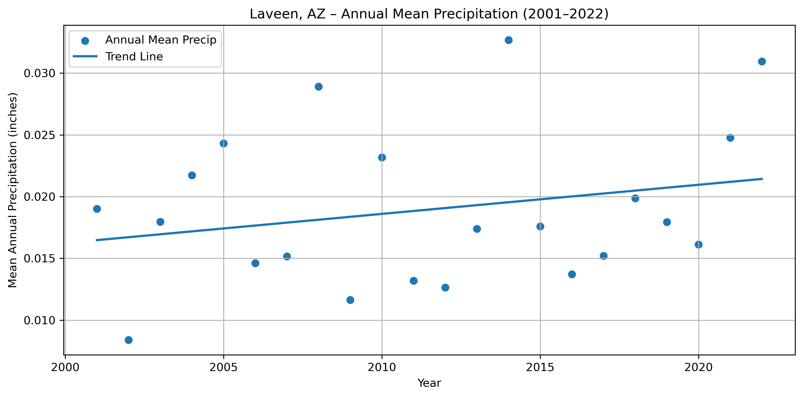
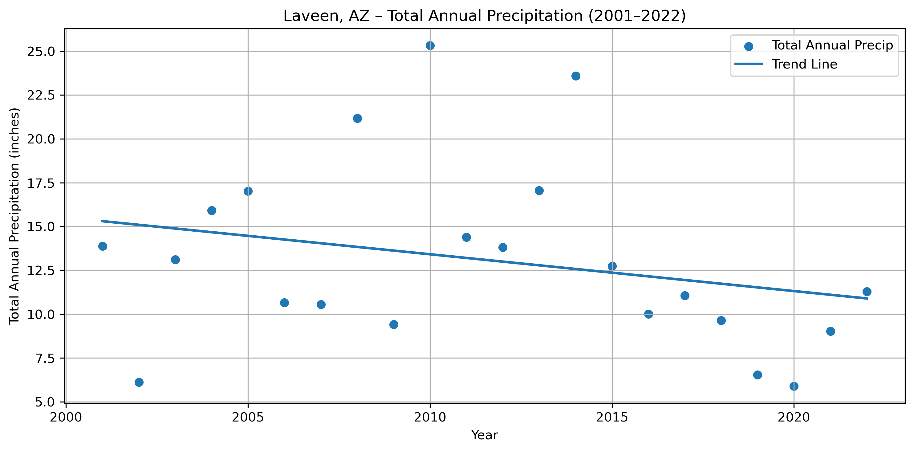
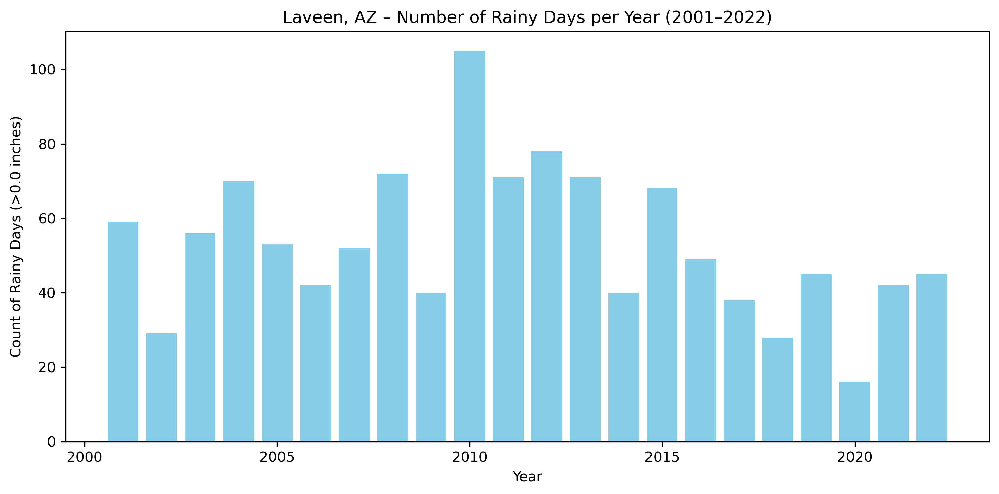
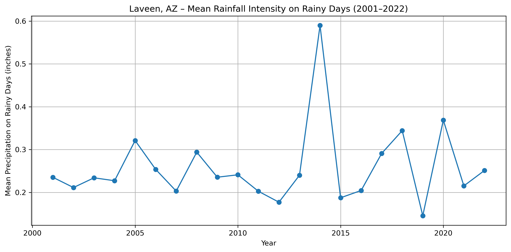
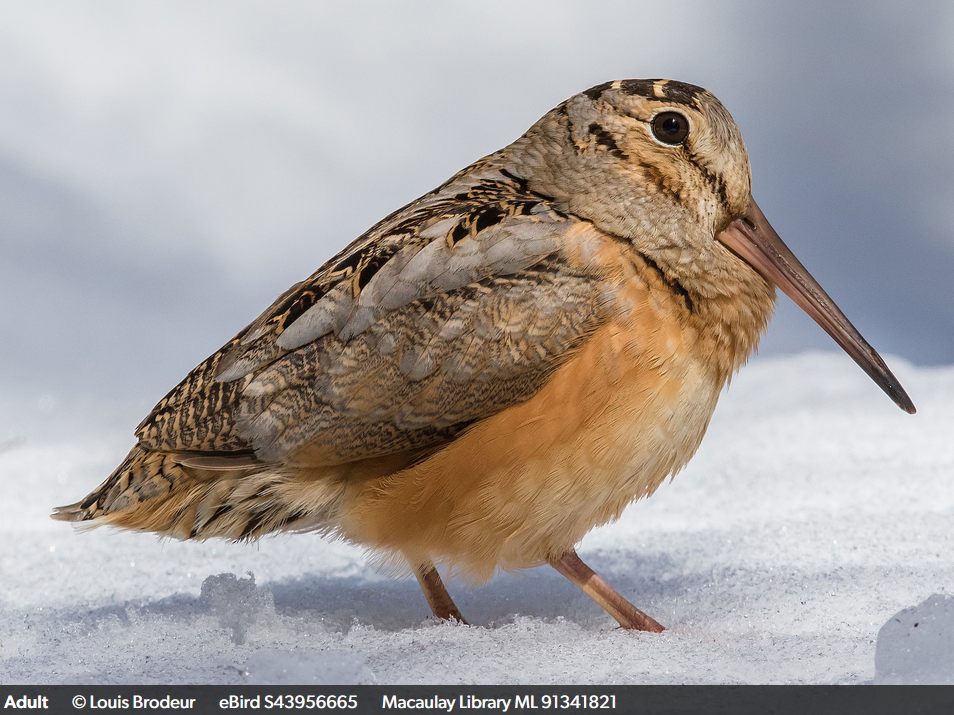
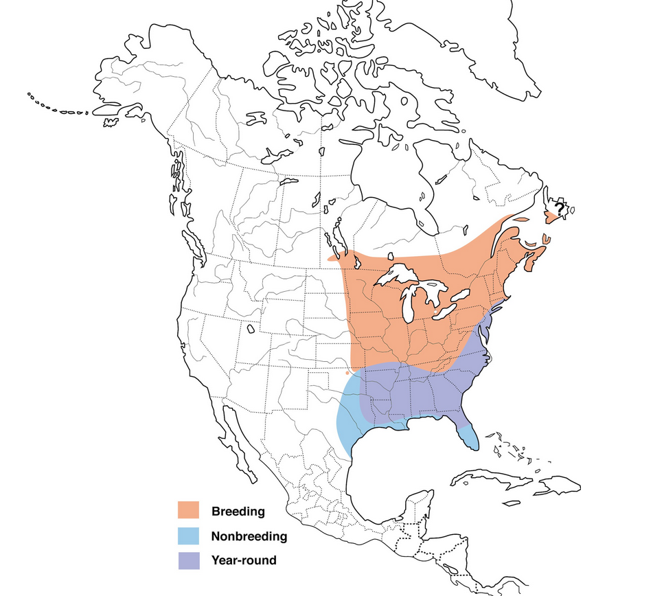
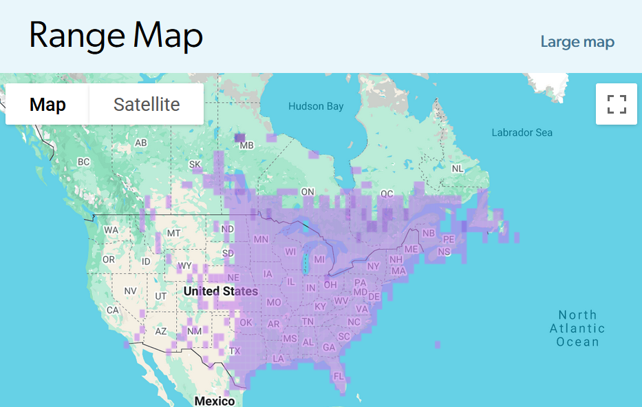

  

  

    <h1>Kayleigh Ward</h1>
    

      Environmental sociologist, community-engaged researcher, and public health advocate.
    

    

      I study water affordability, environmental justice, and how infrastructure and policy shape environmental health outcomes.
    

    

      <a href="https://kayleighward.com/">Personal Website</a> ·
      <a href="https://github.com/kward-alt">GitHub</a>
    

  

---

## Featured Projects

  

    <h3><a href="#habitat">Habitat Suitability</a></h3>
    
Climate modeling of two prarie sites using fuzzy modeling.

    
<em>Climate change · HSI · Remote sensing</em>

  

  
  

    <h3><a href="{{ '/projects/ramona.html' | relative_url }}">Ramona Fire Recovery</a></h3>
    
Vegetation recovery, NDVI trends, and fire perimeter analysis in Southern California.

    
<em>GIS · Remote sensing · NDVI · Fire ecology</em>

  

  

    <h3><a href="#gila">Gila River Vegetation Health</a></h3>
    
NDVI trends and water rights impacts on vegetation in Arizona.

    
<em>NDVI · Water policy · Environmental justice · Remote sensing</em>

  

  

    <h3><a href="#boulder">Boulder Climate Trends</a></h3>
    
Long-term temperature change analysis using NOAA data.

    
<em>Climate analysis · NOAA data · Time series · Python</em>

  

  
  

    <h3><a href="#timberdoodle">Timberdoodles (American Woodcock)</a></h3>
    
Species distribution, migration patterns, and data reliability using GBIF and eBird.

    
<em>GBIF · Species distribution · Data validation · Visualization</em>

  

    <h3><a href="#minamisanriku">Minamisanriku Mapping</a></h3>
    
Fieldwork and land-sea boundary mapping in Japan.

  

---

## Research Areas

- Water justice and affordability  
- Environmental health inequities  
- Climate and infrastructure policy  
- Geospatial analysis (GIS + remote sensing)  

---
# EDS Portfolio

# Comparing habitat suitability under climate change for Sorghastrum nutans between Kansas and Illinois {#habitat}

In this project I look at the habitate suitability of Sorghastrum nutans (Indiangrass) under four different climate projections at two different sites in the US. 

## Indiangrass overview

I selected Sorghastrum nutans (Indiangrass), a native warm-season perennial bunch grass (i.e., grows in clumps) common in tallgrass and mixed-grass prairie systems across much of the central and eastern contiguous United States. It is typically found in open grasslands, prairie restorations (or land reclaimation projects), fallow farmland, and especially where periodic fire limits woody encroachment. There are two sites of interest for this project: Illinois and Kansas.

Geographic range is broad in CONUS, but persistence is strongest in intact prairie landscapes. Main pressures that disrupt indiangrass include conversion to agriculture/urban land cover (the primary driver of indiangrass loss), fragmentation (also due to human activity), woody encroachment from fire suppression, and climate-driven loss due to moisture stress. Since moisture stress is important I focus on precipation as my climate variable in this project.
Benefits of indiangrass

The loss of indiagrass harms both ecosystem services and native species that rely on it. For example, indiangrass provides substantial ecological value:

    - It is used as nesting material and escape cover for grassland birds (Brakie, 2017)
    - Their seeds provide additional nutrition for grassland birds (Brakie, 2017)
    - It provides grazing for buffalo and for livestock (Brakie, 2017)

## The role of fire

Walker (1991) also notes that fire disturbance is important to the persistence or lacktherof of indiangrass. Fire has historically maintained tallgrass prairie, and indiangrass is repeatedly characterized as fire tolerant through postfire sprouting from rhizomes. Walker (1991) also notes controlled burns (particularly late spring burns in many tallgrass systems) have been observed to support the proliferation of the species. In restoration and conservation practice, indiangrass is widely used for prairie reconstruction, conservation cover, and erosion control from wind and rain. It is typically planted in mixtures with other warm-season grasses to rebuild tallgrass habitats (Brakie, 2017).

## Key traits and characteristics
**Key traits** [Brakie, 2017; USDA, n.d.]
- Trait: [Indiangrass typical range / value]
- Height (culms): [~1–2.5 m (3–8 ft)]
- Leaf blade width: [~5–10 mm (to ~12 mm reported in some materials)]
- Flowering window: [Mid‑summer to fall; often ~Jul–Oct across the range (earlier north, later south)]
- Seed mass: [~1.9–2.0 g per 1,000 seeds (≈1.9–2.0 mg per seed; method-dependent)]
- Season: [C4 (warm-season)]
- Lifespan: [Perennial; productive seed stands commonly reported ~10–15 years under managed production]
- pH range: [4.8-8.0]
- Precipitation: [11-45 inches]
- Root depth: [24 inches minimum]
- Salinity toleranace: [Medium]
- Shade tolerance: [High]

#### Note: there are also cultivars of Indiangrass that have different traits, but for the purpose of this project I am just referring to the primary species in the PLANTS database.

# The project

To evaluate habitat suitability under climate change, I use:

- **Soil pH (POLARIS, 60-100 cm)** as an edaphic control. I use 60-100cm due to the root depth of Indiangrass.
- **Slope** (derived from SRTM) as a topographic constraint (flatter prairie landscapes are generally more suitable). However the two sites I review in this project are both mostly flat to hilly (Kansas and Illinois).
- **Annual precipitation** climate normal (MACAv2) as the primary climate driver for this C4 grass. Since the plant is sensitive to precipitation I thought this would be a somewhat good substitution for the lack of fire regime data in the model.

**Core question:** How does projected mid-century climate change (relative to a historical baseline) alter suitable habitat for S. nutans across contrasting prairie-region sites in CONUS [Kansas v. Illinois], and how sensitive are results to climate-model uncertainty?

**Sites:**
- Tallgrass Prairie National Preserve, Kansas [referred to as Tallgrass in the notebook]
- Midewin National Tallgrass Prairie, Illinois [referred to as Midewin in the notebook]

<src="/img/site_maps.png" width="600" height="600">

*Figure 1* Locations of and boundaries of Tallgrass and Midewin sites

## The Last "Stand" or the Tallgrass Prairie National Preserve, Kansas

The National Park Service notes that "tallgrass prairie once covered 170 million acres of North America...[but] today less than 4% remains intact, mostly in the Kansas Flint Hills." [National Park Service, n.d.; National Preserve Kansas]

As such the Flint Hills tallgrass landscape has a relatively intact prairie and strong fire-grazing ecological dynamics. This site makes for good comparison to Illinois where that has been mostly a restoration project not a conservation project.

We can also see in the Kansas map that the surrounding area is also unfragmented and not interrupted by other land cover, namely built environments.

## From Munitions to Grass? The Midewin National Tallgrass Prairie, Illinois

The Illinois site is a large restoration project. As noted by the U.S. Forestry Service (n.d.), the site "[Turns] back the clock from a landscape dominated by rusting munitions factories and abandoned ammunitions bunkers into a 20,283-acre pristine tallgrass prairie." They go one to embellish that this, "makes the Midewin a compelling vision for landscape scale restoration."

Of course, we know that this site is not pristine especially if it was previously a significantly disturbed site by a different form of "fire."

Noteably, the Illinois site is very different from the Kansas site. The area around Midewin are very developed and there is a lot of fragmentation.

**Expected suitability**

I expect both sites to remain at least mostly suitable because S. nutans is broadly distributed across the U.S., and based on its traits, seems to establish itself well as long as woody invasives are managed. Similarly, both sites are (seemingly) cared for due to the threatened status of indiangrass. However, I do expect greater climate-model spread in projected suitability at Midewin (IL) because it is a more fragmented site, and may be more sensitive to precipitation-seasonality shifts. Tallgrass (KS) should remain comparatively strong since this habitat has been preserved and not disturbed by ammunition.

## Applying climate models
In order to to do climate projections on these two sites, two different timeframes are required for modeling or "climate normals." For the purposes of my project I use the following: 

- Historical baseline: 1981-2010 (MACAv2 historical scenario)
- Mid-century future: 2041-2070 (MACAv2 RCP8.5 scenario)

This pair should provide a good baseline and future modeling comparison. However, the two sites should likely be modeled with their own independent set of time periods (even though that doesn't allow for comparison then). I say this because the Tallgrass (KS) site was established in 1996 and has been preserved for 30 years now so the habitat is more stable. In comparison the Midewin (IL) site was "established" in 1996, but due to the reclamation process, was not actually finished until 2004. That is almost a decade of difference between the two sites in terms of establishment.

## Climate models used

This analysis uses four global climate models (GCMs). These models simulate future climate under the RCP8.5 emissions scenario and are commonly used to capture uncertainty across different climate projections.

**Models Used:**

1. CanESM2 (Canada) [best fit for warm & wet]
- Developed by: Canadian Centre for Climate Modelling and Analysis
- Type: Earth system model (includes carbon cycle feedbacks)
- General traits:
  - Often shows warmer and wetter futures
  - Can "produce" strong vegetation and ecosystem responses
    - Why included:
      - Represents a higher-sensitivity climate response
      - Because I am using precipitation and soil ph this model may provide a good assessment for Indiangrass (can handle dry and wet years)

2. CNRM-CM5 (France) [best fit for more "moderate" conditions]
- Developed by: Centre National de Recherches Météorologiques
- Type: Coupled atmosphere–ocean model
- General traits:
  - Typically produces moderate warming signals
  - Often considered middle-of-the-road among CMIP5 models
    -Why included:
      - Serves as a baseline / moderate scenario
      - Since Indiangrass is established across much of the U.S. a more "intermediate" scenario could suit it better since it seems to thrive pretty much anywhere that it gets established (and not crowded out by woody species)

3. HadGEM2-ES (United Kingdom) [best fit for warm & dry]
- Developed by: Met Office Hadley Centre
- Type: Earth system model (includes atmospheric chemistry + carbon cycle)
  = General traits:
    - Often projects strong warming and drying in some regions
    - Captures complex land–atmosphere interactions
      - Why included:
        - Represents perhaps the most reasonable model for the two sites in the future, as both Kansas and Illinois are getting warmer but not wetter (CanESM2)

4. inmcm4 (Russia) [best for counterfactual cooler & dry]
- Developed by: Institute of Numerical Mathematics
- Type: Coupled climate model
  - General traits:
    - Often shows lower climate sensitivity
    - Produces more conservative (muted) changes
      - Why included:
        - Provides a more conservative projection
        - I thought it would provide an interesting contrast to the other models since Indiangrass does not have a high cold tolerance

## Soil data
I pulled the soil data from the POLARIS dataset based on the PLANTS database criteria I specified earlier in the indiangrass introduction. Since the minimum depth of roots for indiangrass is 24 inches, I am using the 60 to 100 cm depth in POLARIS. 24 inches is approximately 60 cm and since it is the minimum, the 60cm to 100cm depth is most suitable.

<src="/img/soil_ph_maps.png" width="600" height="600">

*Figure 2* The deep dark blue areas on these maps are water (especially for the Midewin site), which I also confirmed via google earth. I expect there is a lot of fertilizer run off in these areas as there is both agriculture and built environments near these sites. We can see across these maps that beyond water sources, the rest of the landscape meets the pH range for Indiangrass as we expected (4.8-8.0).

## Topographic data
I also plotted the topographic data or slopes of these sites. As one would expect from Kansas and Illinois they do not have very heterogenious elevations (e.g. mountains).

<src="/img/topography_maps.png" width="600" height="600">

*Figure 3* Based on the gradual change in elevation (in meters), we can see that both of these sites feature gentle hills with the Tallgrass site being more clearly hilly (low of 370 meters above sea level to a high of 450) where as the Midewin site has a west to east hill (low elevation of 165 meters to 205 meters). This means the lower areas of the sites will be wetter which we should also see highlighted in the climate modeling. 

## Climate model data 

I used MACAv2-METDATA daily downscaled climate projections to characterize precipitation (pr) and computed 30-year climate normals by averaging annual precipitation totals over each target period. MACAv2 provides statistically downscaled climate data at ~4 km resolution, derived from CMIP5 global climate models and bias-corrected using historical observations.

In order to project these models I use fuzzy logic modeling. Fuzzy logic modeling is a useful approach for climate projection analysis because it allows environmental variables to be treated as gradual suitability conditions rather than strict yes/no thresholds. Instead of classifying either of my locations as simply “suitable” or “unsuitable,” fuzzy logic assigns each variable, such as precipitation, temperature, slope, or soil conditions, a membership score between 0 and 1 based on how closely it matches an ideal range. These scores can then be combined to estimate overall suitability under historical and future climate scenarios. 

For our modeling we can see some basic information on habitat quality (HSI) first before plotting the habitate suitability. 

<src="/img/mean_hsi.png" width="600" height="600">

*Figure 4* Summary table of HSI at both sites

*Midewin (IL)*
- Historical to Future Mean HSI: 0.866 → 0.824
  - So between time periods a little bit of a drop.
- Suitable area: 47% → 47%
  - Really did not change much at all.

*Tallgrass (KS)*
- Historical to Future Mean HSI: 0.836 → 0.833
  - Very little change in Kansas.
- Suitable area: 45% → 45%
  - Seemingly no climate change effects for the Kansas Preserve

It is important to note that this is the suitability within the bounds of the preserve. It does not mean that indiangrass is not more suitable in other areas of Kansas or Illinois. The HSI is stable over time, and roughly 50% of each site remains a good fit for the species. Importantly the habitat quality (HSI) stays stable over time.

What is interesting is that under climate change we would expect northern sites to do better, but Illinois fair marginally worse than Kansas. Kansas may just be in the south-north range sweet spot for indiangrass even under projected precipitation stress.

**Considering what the climate models show**
We can also consider how HSI would change under each of the selected climate models. 

<src="/img/change_HSI_model.png" width="600" height="600">

*Figure 5* Summary table of HSI change at both sites under the different climate models. 

From this table we can see that CanESM2 (warmer and wetter) has a worse outcome for the Midewin, IL site (a total change or delta hsi of a little more than 10%) whereas there is no effect at the Tallgrass, Kansas site. Even under a moderate warming scenario (CNRM-CM5) the Midewin site struggles. In comparison the Tallgrass site is seemingly impervious to any projected climate effects. As a result, the Midewin site is more sensitive/vulnerable to both moderate warming, and warmer + wetter scenarios. As the CanESM2 projection is the most severe, we will plot that.  

<src="/img/hsi_maps_CanESM2.png" width="600" height="600">
*Figure 6* A plot of the two sites under the CanESM2 scenario. As we already knew from the delta HSI, the Midewin site fairs far worse across the entire extent of the prairie. 

## Key takeaway

Climate change produces very modest declines in habitat quality (HSI) at Midewin, while the overall extent of suitable habitat remains largely stable across both sites (above 50%). Tallgrass Prairie (KS) remains highly stable, while Midewin (IL) shows slightly greater sensitivity to future conditions.

## Larger analysis

Across both sites, the fuzzy model indicates that habitat suitability for _Sorghastrum nutans_ remains consistently high under both historical (1981–2010) and future (2041–2070) climate conditions (precipitation). Mean habitat suitability values are slightly higher under historical conditions and decline modestly in future projections, particularly at the Midewin National Tallgrass Prairie site.

At Midewin, mean HSI decreases from approximately 0.87 to 0.82, indicating a measurable reduction in overall habitat quality. However, the percentage of area classified as suitable remains nearly unchanged (~47%), suggesting that while conditions become somewhat less optimal, most of the landscape remains above the suitability threshold. This pattern indicates a within-class decline in suitability, rather than a large-scale loss of suitable habitat.

In contrast, the Tallgrass Prairie site shows minimal change between historical and future conditions. Mean HSI values remain nearly constant (~0.84), and suitable area also remains stable (~45%). This suggests that Tallgrass Prairie is relatively robust to projected mid-century climate changes, at least under the variables included in this model.

Compared to earlier iterations of this analysis (re:boundarygate), differences across climate models are less pronounced. This reflects improvements in spatial processing, including the use of official site boundaries and more consistent raster alignment. As a result, I believe the updated outputs provide a more stable and realistic estimate of habitat suitability.

## Quanitfying change over time due to model differences

Although earlier runs suggested strong model disagreement—particularly at the Midewin site—the updated results indicate more consistent outcomes across models. Rather than large divergences, the primary pattern is a modest decline in mean suitability at Midewin and near-complete stability at Tallgrass.

This suggests that projected climate impacts on _Sorghastrum nutans_ habitat are relatively subtle at the spatial scale of this analysis. The results emphasize that changes in habitat quality may occur without large changes in total suitable area.

For example in the pivot table, examining model-specific changes in habitat suitability reveals that the CanESM2 model (warm + wet projection) produces the largest declines in HSI at both sites. This is expected since my climate variable was precipitation. In contrast, the HadGEM2 model (often characterized as warmer and drier) shows little to no change in suitability.

I first thought that drier conditions should to reduce habitat suitability more strongly. However, I have to think how the model thinks, so this pattern reflects the structure of the fuzzy model, which is primarily driven by precipitation rather than temperature. In this framework, increases in precipitation beyond the optimal range can reduce suitability just as much as decreases below it. As a result, the “warm + wet” scenario produces larger declines because it pushes conditions outside the modeled optimal precipitation window, whereas the “warm + dry” scenario may still fall within acceptable bounds even if we know the US will experience warming.

## Limitations

I used a compact fuzzy rule set (soil pH, slope, precipitation) and did not include disturbance regime (e.g., fire/grazing), land use, or dispersal constraints, so the maps represent only potential climatic suitability.

Additionally, while official administrative boundaries were used to improve spatial accuracy, these boundaries do not perfectly correspond to ecological prairie extent. Therefore, the results and plots I have should be interpreted as approximate representations of site-level suitability rather than precise delineations of habitat.

## More grass digging--Why is the grass not *greener* on the other site

The biggest limitation, based on the literature, is actually the inability of my fuzzy model to capture fire ecology. As mentioned in the introduction at the beginning of this notebook, fire suppression may negative effect indiangrass because it allows intrusion by woody species. This is important because as Walker (1991) states, "The maintenance of the tallgrass prairie before European settlement was largely due to the occurrence of fire. In the absence of fire, invasion by woody species is common [12]. Without periodic fires Indiangrass declines in terms of reproductive effort and relative cover [32]. Indiangrass survives fire by sprouting from on-site surviving rhizomes." (FIRE ECOLOGY OR ADAPTATIONS).

Because fire regime is not included in my model, these results reflect climatic suitability only and may underestimate the importance of disturbance processes in maintaining high-quality habitat. This would be important to model because Walker (1991) makes it clear that fire is good for this species and can rebound quickly depending on the season. Noteably annual burns are important. I am including the excerpt from the section PLANT RESPONSE TO FIRE

    Indiangrass density and apparent vigor [17,22], number of flowering
    culms [9,38,45], and percent canopy and basal cover [5,57] increase with
    late spring burning conducted prior to green-up.  Burning during other
    seasons may increase flowering stems [38] or decrease percent
    composition of Indiangrass [72].  The greatest increase in canopy cover,
    density, production, and flowering occurs following annual burns
    [2,25,44,45].  Seeds are generally absent in burned soils, and most
    reproduction following fire is vegetative [2].  Fire intensity affects
    short-term rhizome reproduction.  Late summer fires (September 5th) were
    conducted with both high-intensity and low-intensity fuels.  Little or
    no damage occurred on the low-intensity fuel area, but tiller densities
    were reduced on the high-intensity fuel area.  However, tiller density
    returned to normal by the following August. (Walker, 1991).

It would be interesting to model the affects of changing fire regimes, especially as humans try to tamp down on fires as much as possible. **My hypothesis is that: Kansas is less densely populated than Illinois, which may allow for more frequent use of prescribed fire and fewer constraints on fire management. In contrast, more developed landscapes in Illinois may limit the use of fire as a management tool, potentially influencing habitat conditions for fire-dependent species.** If we look at the site plots from early with the topo basemaps, the Illinois site is encircled by built environments, so I imagine the likelihood of prescribed burns is very low compared to Kansas.

### References

Brakie, M. 2017. Plant Guide for Indiangrass (Sorghastrum nutans). USDA-Natural Resources Conservation Service, East Texas Plant Materials Center. Nacogdoches, TX 75964. https://www.nrcs.usda.gov/plantmaterials/etpmcpg13196.pdf

Climate Toolbox model-selection resources and MACA model comparison tools (https://climatetoolbox.org)

National Park Service. n.d. National Preserve Kansas. https://www.nps.gov/tapr/index.htm U.S. Forestry Service. n.d. Midewin National Tallgrass Prairie. https://www.fs.usda.gov/r09/midewin

USDA. n.d. Sorghastrum nutans (L.) Nash. PLANTS database. https://plants.sc.egov.usda.gov/plant-profile/SONU2/characteristics

Walkup, Crystal J. 1991. Sorgastrum nutans. In: Fire Effects Information System, [Online]. U.S. Department of Agriculture, Forest Service, Rocky Mountain Research Station, Fire Sciences Laboratory (Producer). Available: https://www.fs.usda.gov/database/feis/plants/graminoid/sornut/all.html [2026, March 23].

---

### Vegetation Health on the Gila River {#gila}
In 2004, the Akimel O’otham and Tohono O’odham tribes won a water rights settlement in the US Supreme Court. However, despite this historic win for tribal sovereignty, and the protection of important social, cultural and environmental ways, the return of water rights has unfortunately not lead to an improvement in vegetation health. In a previous exercise I explored the mean NDVI differences between the Gila boundary and the areas outside of it during the month of July between 2001-2022. I will recap that below before we explore some other data to see if in fact the Gila river basin is not improving. 

Learn more about the Gila River Indian Community [here](https://www.gilariver.org/) 

You can check out the code for the precipitation analysis [here](img/precipitation-01-wrangle-and-plot.html)

#### Mean July NDVI Inside vs. Outside Gila (2001-2022)
<embed type="text/html" src="img/july_ndvi_inside_outside.html" width="400" height="400">
The first thing to notice is that for all the NDVI mean values, regardless of if they are inside or outside Gila, are positive in July. This indicates that peak-season vegetation greenness is reliably present across the region. However, the magnitude of July NDVI differs substantially between the two areas.
Second, across the entire 2001–2022 period, the outside Gila region displays higher mean July NDVI than the inside Gila region. The outside area generally ranges from approximately 0.21 to 0.26, showing moderate but stable July greenness. In contrast, NDVI values inside Gila remain consistently below even the lowest values observed outside the boundary (with the only exception being 2005 where inside Gila has a mean July NVDI of almost 0.24).

#### Mean July NDVI difference (Gila v. outside, 2001-2022)
<embed type="text/html" src="img/july_ndvi_inside_outside_difference.html" width="400" height="400">
For each year, every NDVI value is the (Mean July NDVI inside Gila) minus (Mean July NDVI outside Gila). Essentially what this graph lets us answer is within each given year from 2001 to 2022, how much greener was the inside of the Gila boundary to its surroundings? The short answer is that inside Gila was never greener than outside (just like we see in plot 1).

The long answer: You will notice immediately that in comparison to the first plot, this line starts BELOW 0 and never crosses 0, and it is always a negative NDVI value. However, unlike the first plot, this negative NDVI value goes from about -0.05 in 2001 to -0.02 in 2022. So we are getting closer to 0, which means the greenness within the Gila boundary is becoming SIMILARLY green to its surroundings. 

This narrowing gap may suggest a few things, and also should cause us to think about other contributing factors (and counterfactuals):
1.	That vegetation conditions inside Gila are in fact improving. 
2.	There may be shifts in land use or management contributing to this improvement (OR) the returning of water rights made their burden on the environment less. 
3.	There are other changing external conditions related to complex factors, like climate change, that may actually be affecting the areas outside Gila more NEGATIVELY leading to the narrowing. 
4.	Most complex reason could be that between the two areas that there is increasing environmental similarity. 

In all of these possible scenarios or reasons for the narrowing gap, it is obvious that we do not have enough data to conclude whether this narrowing gap is due to water rights or not. However, the plot does clearly show a long-term narrowing of the vegetation greenness gap between the inside and outside of the Gila boundary in July.

#### So how can we move beyond the limitations of NDVI data?
Given what we know so far, even after the 2004 water rights settlement, there are slow but positive change in mean summer NDVI within the Gila boundary. This suggests that, at least for July greenness, the vegetation response did not show a dramatic or immediate increase even nearly two decades after this policy change.

But we could track other potential positive indicators of the 2004 water rights settlement. So let’s:
1. Take our Gila boundary (7 districts) and create a 2001-2022 land cover difference map to see if we have more or less vegetation in this time period. 
 a.	**What this allows us to do:** given the effects of climate change, NDVI may not be a reliable measure for seeing the environmental effects of returned water rights. This area is very hot, and also suffers from drought. Looking at total land cover change lets us better see **whether there is a “green” expansion**
2. Look up the nearest Gila NOAA Station to pull precipitation data (2001-2022), to see if potentially there has been less rain in this period which is stressing out our vegetation.
   
#### Tracking precipitation
Since NDVI data is not accessible, lets consider the precipitation question. Unfortunately, NOAA does not have a station to record precipitation at the center of the reservation. However, we can use a close zip code (Laveen, AZ 85339 (Location ID: ZIP:85339). Laveen overlaps with the western half of the Gila boundary, and can still tell us whether the precipitation into the Gila basin in this area change a lot over this time period.  

The specific station we are using is USC00025270. The precipitation csv provides daily totals of rainfall for the dates I called for (Jan 1, 2001 to December 31, 2022). Below I have created a trend graph of the annual mean precipitation, a trend graph of the total annual precipitation, and then calculations for the number of “rainy” days (precip  > 0.0 inches) and “insanity” of rain on rainy days. 

### Interpretation of Rainy-Day Frequency and Rainfall Intensity (Laveen, AZ: 2001–2022)
The precipitation record for Laveen (which abuts and overlaps the Gila boundary) from 2001–2022 reveals an important pattern: the frequency of rainy days has declined, while the intensity of rainfall on days that do receive precipitation has remained variable and occasionally increased, though without a strong upward trend. These two shifts together help explain why the mean daily precipitation shows a very small positive slope, while total annual precipitation trends downward more strongly.

1. Rainy-day frequency has declined sharply over time
Over the 22-year period, the number of days with measurable precipitation exhibits a somewhat downward pattern:
- Early 2000s: frequent rainy years (e.g., 59 rainy days in 2001, 70 in 2004, 72 in 2008, 105 in 2010).
- Mid-to-late 2010s and early 2020s: substantially fewer rainy days, including extremely dry years (28 rainy days in 2018, 16 in 2020).

2. Rainfall intensity on rainy days is highly variable but not strongly increasing

The mean precipitation per rainy day (intensity) fluctuates considerably from year to year. Typical rainy-day intensities cluster around 0.20–0.30 inches. Some years show notably high intensities (0.59 in 2014, 0.37 in 2020, 0.34 in 2018), indicating substantial winter storms. Several years in the 2010s show much lower intensities (0.17–0.20 inches).

Overall, the intensity trend is flat to slightly increasing, but the variability is too large to indicate a clear direction.

3. Together, these patterns explain the mean vs. total precipitation trends
Mean daily precipitation includes all 365 days, many of which have zero rainfall. A slight rise in event intensity—even with fewer rainy days—can nudge the mean upward.
Total annual precipitation is driven almost entirely by the number of rainy days. With rainy-day counts falling from around 60–100 per year early on to 16–45 per year recently, totals drop sharply even if intensity remains stable or rises occasionally. This produces the stronger negative slope in total precipitation.

4. In short:
- Rainy days: clearly decreasing → drives down annual totals
- Rainfall intensity: variable, occasionally high, but no strong trend
- Mean precipitation: slightly positive because intensity on rainy days can rise even while rainy days decrease
- Total precipitation: stronger negative trend because fewer events mean fewer opportunities for accumulation

### Coming back to Gila
Considering that the gap is narrowing between Gila and outside areas in terms of mean NDVI, and that rainfall has actually slightly declined during this period. One of our assumptions from earlier very well may be true. It may be the case that outside areas *are* getting worse compared to Gila. Essentially they are suffering more from the decline in rainfall than Gila is, now that Gila has their water rights back. Likely what we will see in the *longer* term, is Gila having a greater mean NVDI and crossing over 0.

---

### The wonderful world of Timberdoodles (aka American Woodcock) {#timberdoodle}
 

Some years ago when I was working in Boston a coworker of mine got me into birding. Birding is one of those hobbies that you do not do by half. One of my first sightings was an American Woodcock, also lovingly known as a Timberdoodle. They are also characterized by the males' signature PEENT! call and their undulating strut. There has been a lot of speculation both by ornithologists (bird scientists) and birders as to why Timberdoodles do this. Beyond struting during their displays, some believe that this helps them coax worms out of the soil, while others contend it may be a way to confuse potential predators due to the movement. Regardless it is mesmerizing!

Timberdoodles love to move through leaf litter and primarily are found in the eastern half of the United States and are most active in March. As they are camouflaged well in the leaves they prefer wooded areas, or really anywhere they can hide in brush. What is most important to a Timberdoodle though is finding a nice field to do its flight displays at dusk for finding a potential mate. Of all the birds I have had the opportunity to observe, Timberdoodles have the most impressive display. They rocket up into the air by circling up to about 300 feet (where we unfortunately can't really see them). When males do these displays their wings make a unique "tweeting" sound which helps draw the attention of potential mates. When the reach the top, it will sing, and then nearly free fall back down to the ground in a zig-zag pattern before quickly gliding to a stop. For this entire display they will start and stop in the same location. Males will continue this display for up to an hour at times. 

If you would like to learn more about the American Woodcock, I highly recommend joining ebird to check out latest sightings of them, and to enjoy other videos and recordings of them. Unfortunately if you are in the western half of the United States, you will need to make a trip out east to see them. [Check out ebird]("https://ebird.org/species/amewoo") 

If you have never heard what a male Timberdoodle's call sounds like, hear a recording of their PEENT below: 
<iframe src="https://macaulaylibrary.org/asset/96879691/embed" height="430" width="640" frameborder="0" allowfullscreen></iframe>

See the famous Timberdoodle strut below: 
<iframe src="https://macaulaylibrary.org/asset/193053781/embed" height="510" width="640" frameborder="0" allowfullscreen></iframe>

#### Where do Timberdoodles go? 
As mentioned before Timberdoodles almost never cross over the "middle" of the United States. This is one of things I lament about living in Colorado, because it is impossible to see these bird's flight displays here. However, when they do somewhat cross the center line of the US, this happens during migration. They have two key migration periods. In the spring (March-May) they can move up the east coast into Canada and skim across Northern US states like Minnesota and Wisconsin. In the winter (September-November) they move back down south, but always staying to the eastern half of the United States. 

##### Think! Think! Think!
Knowing this new information, I invite you to go back to the ebird link from earlier and look at the range map of sightings. Do you notice anything odd? That's right, we have Timberdoodle sightings where they shouldn't be! Most of these "sightings" are misidentifications, especially in the Southwest. How can we be sure these sightings are a mistake by too-enthusiatic birders? We can look at American Woodcocks that have been tracked by Cornell Lab. ebird is managed by the Cornell Lab of Ornithology. While the original link I gave you to explore links to the more public-friendly ebird page for American Woodcocks, going forward we will need to review [Cornell Labs full report](https://birdsoftheworld.org/bow/species/amewoo/cur/introduction) on our favorite bird. 

#### Comparing what we know about migration
While I knew the lives of Timberdoodles from my birder co-worker (the amazing Dr. Kimberley Garrett!), here we can see more clearly that the migration paths of these birds do not match up with the range map of sightings on ebird. Let's compare them side by side (or top to bottom depending on your screen size). 

 
You can view this image full size from [Cornell Labs](https://birdsoftheworld.org/bow/species/amewoo/cur/introduction)

You can expand this map on the [ebird](https://ebird.org/species/amewoo) page for the American Woodcock

You will notice that some of the range map sightings do line up with the migration flight maps from Cornell Labs. But let's see this migration path in motion. 

McAuley, D. G., D. M. Keppie, and R. M. Whiting Jr. (2020). American Woodcock (Scolopax minor), version 1.0. In Birds of the World (A. F. Poole, Editor). Cornell Lab of Ornithology, Ithaca, NY, USA. https://doi.org/10.2173/bow.amewoo.01

#### Migration in motion
We can use occurance data from the Global Biodiversity Information Facility [(GBIF)](https://www.gbif.org/), for the American Woodcock or Scolopax minor (J.F.Gmelin, 1789). But why are we using GBIF and not just range data from eBird? eBird data is not vetted by outside sources where GBIF has a variety of controls and standardization practices which makes their data more reliable, applicable and accurate for our comparison.

For those of you interested, here is the longer more detailed reason why GBIF is better:
GBIF provides a uniquely comprehensive and standardized repository of species‐occurrence data, drawing from thousands of sources including museum specimens, government surveys, research networks, environmental DNA projects, and citizen‐science platforms such as eBird. Unlike single-source systems, GBIF harmonizes all incoming records through Darwin Core metadata standards (i.e., standard file formats) and applies transparent, automated data-quality checks that flag issues in taxonomy, geolocation, duplication, temporal accuracy, and metadata completeness. This consistent validation, combined with integration into a global taxonomic backbone, allows users to trace records to their source and filter by quality metrics tailored to analytical needs. While eBird offers exceptionally high-resolution data for birds, GBIF provides broader taxonomic coverage, richer metadata, and a standardized quality-control framework that enhances interoperability and makes its occurrence data particularly suited for comparative, cross-taxa, and global ecological analyses. [Learn even MORE about GBIF controls](https://www.gbif.org/data-quality-requirements-occurrences)

We will use occurence data from 2022 to visualize migration patterns from January to November. Explore the slider below and see how this migration map compares to the eBird range map and the static migration path map from Cornell Labs. 

<embed type="text/html" src="img/migration.html" width="600" height="600">

##### Note
You may notice when you scroll your mouse over the map that you get a normalized occurence value (which is also what the legend of this map is referencing). Normalization is essential to letting us compae data from different samples or studies that may have varying sampling protocols or biases. This is because even though GBIF has many required vetting standards for what can and cannot be recorded as an "occurence," some occurences are still more accurate than others. By normalizing we can compare the data from different samples or studies, or in this case, occurences of differing "quality." 

For our interactive map above this just means that in January-March we see a greater density of Timberdoodles along the east coast and through Appalachia (very light blue v. very dark blue). If you spend some time looking at values you will see that we have some normalized occurence values of 0.2 compared to 0.1 or even smaller. In this case an area with an value of 0.2 has twice the relative occurence (or traces or abundence) of American Woodcocks compared to areas with a value of 0.1.

#### Migration wrap-up
So what have we learned about Timberdoodles and their movements? First, if anyone tells you they saw one in California you can tell them they are mistaken. Second, it is important to compare a variety of sources when trying to understand any phenomenon. Looking across our three sources, we see that the GBIF plotted map and the Cornell Labs map line up pretty nicely. We can also see that spring and winter migration pattern discussed earlier where American Woodcocks can be sighted more north in the spring (see the March and April months in the map above), compared to the winter (see November in the map above). 

### Climate Change in Boulder, CO {#boulder}

<embed type="text/html" src="img/annual_temp_trend.png" width="600" height="600">

#### Annual Average Temperatures Show a Gradual Warming Trend? Take a second look!
The fitted trend line reveals a small but consistent increase in average annual temperature over time, with a slope of 0.0326 °F per year. That seems like a small increase however, if we look across the 100 years or so, we do see a significant increase in temperature. We also see year to year variability, especially in the 1930s, 1940s and the late 1990s. The R² value (0.0841) of the OLS regression also indicates that there is variability. However, just because temperatures have been fluxuating does not mean we should ignore the gradual increase in temperature the graph shows.

For example, we can calculate the total temperature change from 1893 to 2023 in Boulder, CO by taking the average temperature change by year (the slope of the trend line) and multiply that by the total number of years. The given slope is 0.0326 °F per year. For Boulder, CO we have temperature data from 1893 to 2023 or 130 years. If we take the slope of 0.0326 °F and multiply it by 130 years we get a total temperature change of 4.2 °F! Suddenly that gradual trend line looks a lot more serious. It is important to keep in mind that we only have temperature data from the last 130 years. If we had larger data modeled back through time we would see a much sharper increase (like with global averages).

Want to see the NCEI data used for this graph? You can download daily summaries for the Boulder, CO Station (USC00050848) [here](https://www.ncdc.noaa.gov/cdo-web/datasets/GHCND/stations/GHCND:USC00050848/detail).

### Minamisanriku {#minamisanriku}

<embed type="text/html" src="img/msr.html" width="600" height="600">
The above image shows the land and sea boundaries of Minamisanriku, Miyagi, Japan where I did much of my graduate school fieldwork. The community is very rural with less than 10,000 people. The community mostly relies on foresty, agriculture and aquaculture for their income. 

## Certifications
* MSU onGEO Professional GIS certificate (Department of Geography, Environment, and Spatial Sciences)
* MSU Community Engagement Certification (University Outreach and Engagement)

# H2OPE Project

The H2OPE (pronounced hope) project emerged after my time with the Social Science Environmental Health Research Institute, where I worked within the Water Equity Team (WET) Lab. H2OPE is an extension of the original research I started under WET, and supports both undergraduate and graduate students interested in studying socio-environmental problems related to water poverty, water equity, and water accessibility. Located at the intersection of equity, public health, and climate, H2OPE produces policy relevant research on how to address modern water issues in the United States.

## Current Projects

- Water Utility Scorecard and Affordability Dashboard: Being produced using R Shiny, the WUSA Dashboard will have data from 226 water utilities, including a scorecard function which grades water utilities on how well their existing assistance programs facilitate affordability and equity. The dashboard will be publicly accessible in 2026.

- Water Affordability and the Climate Gap: This research arm focuses on current issues with customer assistance programs, poverty and worsening climate change (e.g.,* drought and floods) affects on water utilities. Recognizing the climate gap (see Morello‑Frosch and Obasogie, 2023), this project focuses on how the disparate burden of climate change affects the health and well-being of low-income and racially marginalized groups when it comes to water affordability. Using county-level poverty data, flood and drought data, this on-going project assesses the extent to which existing assistance programs meet local poverty needs. Using current water rate projections under climate stress, we are also identifying future trends on the widening water affordability and climate gap.

- Water Policy and Capital Investment Plans (CIPs): This research arm focuses on the social and environmental values embedded in water utilities CIPs to investigate the environmental moral convergence or divergence of water operators. Compared to the water utility’s mission and other programs, this analysis highlights the extent to which utilities fulfill their expressed environmental beliefs.

## Team

Lead by Research Faculty, Kayleigh Ward, Cooperative Institute for Research in Environmental Sciences, Environmental Data Science Innovation & Inclusion Lab at the University of Colorado Boulder

- Lauren Gleason, Graduate Student, University of Colorado Boulder
- Amanda Rampy, Undergraduate Student, Northeastern University
- Sabrina Krista, Undergraduate Student, Northeastern University
- Romi Manela, Undergraduate Student, Northeastern University
- Anika Deodhar, Undergraduate Student, Northeastern University
- Emina Hurtic, Undergraduate Student, Northeastern University

## Publications and Editorials

Forthcoming, Ward, K., Gleason, L., Rampy, A., Krista, S., Manela, R., Hurtic, E., & Deodhar, A. Water assistance policies from 2016-2024: The gap between CAPs, LIHWAP, and Covid-19 moratoria in alleviating water poverty, under review.

Ward, K., Srinivasan, J., Alvord, D., Senier, L., Davis, M., Harlan, S. L., … Deodhar, A. (2024). Municipal capacity for water justice: a cross-case comparison of affordability and equity policies in Pennsylvania and Massachusetts. Journal of Environmental Policy & Planning, 26(4), 353–373.

Forthcoming, Ward, K., Srinivasan, J., Alvord, D., Senier, L., Davis, M., Harlan, S. L., … Deodhar, A. Unaffordable Water in US Cities: How Values and Theories of Justice Motivate Policy. Under review.

